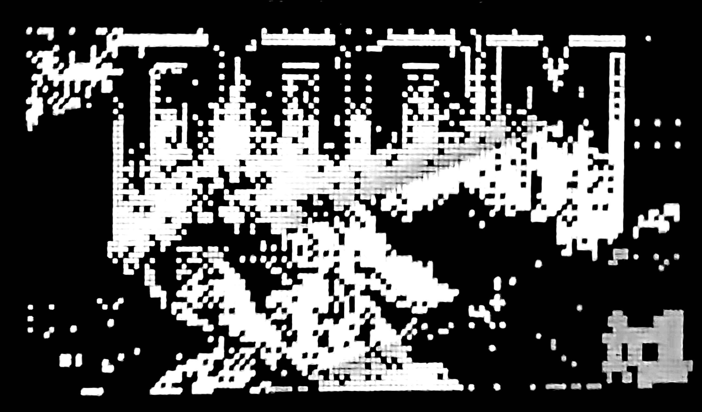

# DOOM: on the ESP32-S3

original DOOM (doomgeneric) on an ESP32-S3, rendered in real time on **a 128×64
OLED display.**



## about

the [doomgeneric](https://github.com/ozkl/doomgeneric) port runs the full DOOM
engine on the ESP32-S3. each frame is downscaled from 640×400 --> 128×64 with a
custom rendering pipeline:

- **2×2 box sampling** to kill texture shimmer at low res
- **Sobel-lite edge detection** preserve wall/sprite outlines
- **Ordered Bayer dithering** for 1-bit shading
- **Contrast stretching** with tunable threshold and gain

## build

requires
[ESP-IDF v5.x+](https://docs.espressif.com/projects/esp-idf/en/latest/esp32s3/get-started/).

```bash
# place your WAD file
cp doom1.wad data/

# build & flash
idf.py set-target esp32s3
idf.py build flash monitor
```

## renderer tuning

In `main/main.c`:

| Define                        | Effect                                    |
| ----------------------------- | ----------------------------------------- |
| `EDGE_THRESHOLD`              | Higher = fewer outlines, cleaner geometry |
| `LUM_THRESHOLD`               | Higher = darker overall image             |
| `CONTRAST_MUL / CONTRAST_DIV` | Contrast gain ratio (default 2.0×)        |

## 

DOOM is © id Software. doomgeneric is licensed under GPLv2.
